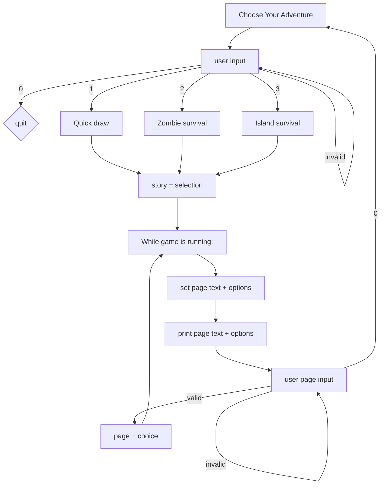
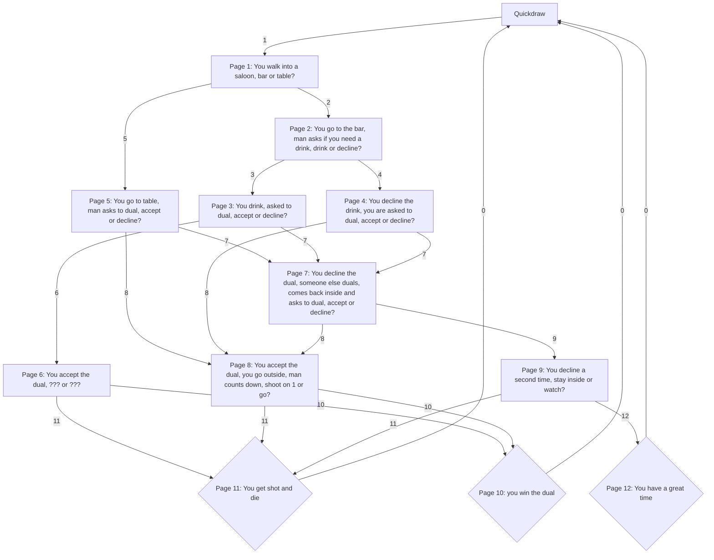
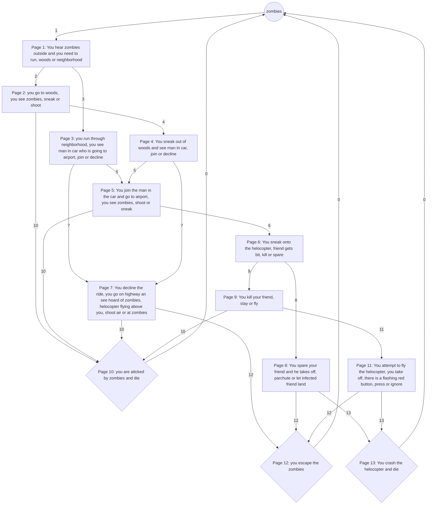
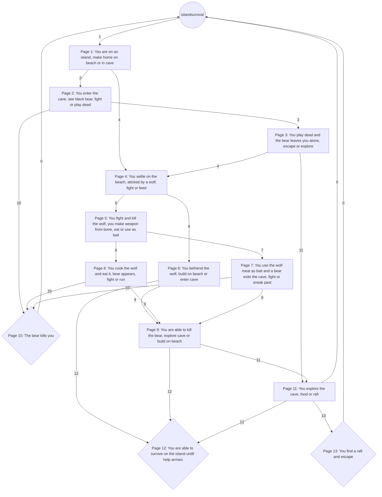

# Mermaid charts

## Game Functions

```mermaid
flowchart TD
  a[Choose Your Adventure] --> b[user input]
  b -- 0 --> quit{quit}
  b -- 1 --> qd[Quick draw]
  b -- 2 --> zomb[Zombie survival]
  b -- 3 --> island[Island survival]
  b -- invalid --> b
  qd --> c[story = selection]
  zomb --> c
  island --> c
  c --> d[While game is running:]
  d --> e[set page text + options]
  e --> f[print page text + options]
  f --> g[user page input]
  g -- 0 --> a
  g -- valid --> h[page = choice]
  g -- invalid --> g
  h --> d
```

## Quickdraw Chart

```mermaid
flowchart TD
    quickdraw["Quickdraw"] -- 1 --> saloon["Page 1: You walk into a saloon, bar or table?"]
    saloon -- 2 --> bar["Page 2: You go to the bar, man asks if you need a drink, drink or decline?"]
    saloon -- 5 --> table["Page 5: You go to table, man asks to dual, accept or decline?"]
    bar -- 3 --> drink["Page 3: You drink, asked to dual, accept or decline?"]
    bar -- 4 --> bardual["Page 4: You decline the drink, you are asked to dual, accept or decline?"]
    table -- 8 --> dual["Page 8: You accept the dual, you go outside, man counts down, shoot on 1 or go?"]
    table -- 7 --> decline["Page 7: You decline the dual, someone else duals, comes back inside and asks to dual, accept or decline?"]
    drink -- 6 --> drunkdual["Page 6: You accept the dual, ??? or ???"]
    drink -- 7 --> decline
    bardual -- 8 --> dual
    bardual -- 7 --> decline
    drunkdual -- 11 --> die{"Page 11: You get shot and die"}
    die -- 0 --> quickdraw
    drunkdual -- 10 --> win{"Page 10: you win the dual"}
    win -- 0 --> quickdraw
    decline -- 8 --> dual
    decline -- 9 --> decline2["Page 9: You decline a second time, stay inside or watch?"]
    dual -- 10 --> win
    dual -- 11 --> die
    decline2 -- 12 --> fun{"Page 12: You have a great time"}
    fun -- 0 --> quickdraw
    decline2 -- 11 --> die
```

## Zombie Chart

```mermaid
flowchart TD
    zombies(("zombies")) -- 1 --> run["Page 1: You hear zombies outside and you need to run, woods or neighborhood"]
    run -- 2 --> woods["Page 2: you go to woods, you see zombies, sneak or shoot"]
    run -- 3 --> hood["Page 3: you run through neighborhood, you see man in car who is going to airport, join or decline"]
    woods -- 4 --> sneakwoods["Page 4: You sneak out of woods and see man in car, join or decline"]
    woods -- 10 --> eaten{"Page 10: you are attcked by zombies and die"}
    eaten -- 0 --> zombies
    hood -- 5 --> car["Page 5: You join the man in the car and go to airport, you see zombies, shoot or sneak"]
    hood -- 7 --> stay["Page 7: You decline the ride, you go on highway an see hoard of zombies, helocopter flying above you, shoot air or at zombies"]
    sneakwoods -- 5 --> car
    sneakwoods -- 7 --> stay
    car -- 6 --> helo["Page 6: You sneak onto the helocopter, friend gets bit, kill or spare"]
    car -- 10 --> eaten
    stay -- 12 --> escape{"Page 12: you escape the zombies"}
    escape -- 0 --> zombies
    stay -- 10 --> eaten
    helo -- 8 --> spare["Page 8: You spare your friend and he takes off, parchute or let infected friend land"]
    helo -- 9 --> kill["Page 9: You kill your friend, stay or fly"]
    spare -- 12 --> escape
    spare -- 13 --> crash{"Page 13: You crash the helocopter and die"}
    kill -- 11 --> fly["Page 11: You attempt to fly the helocopter, you take off, there is a flashing red button, press or ignore"]
    kill -- 10 --> eaten
    fly -- 13 --> crash
    crash -- 0 --> zombies
    fly -- 12 --> escape
```

## Island Chart

```mermaid
flowchart TD
    islandsurvival(("islandsurvival")) -- 1 --> island["Page 1: You are on an island, make home on beach or in cave"]
    island -- 4 --> beach["Page 4: You settle on the beach, attcked by a wolf, fight or feed"]
    island -- 2 --> cave["Page 2: You enter the cave, see black bear, fight or play dead"]
    beach -- 5 --> fightwolf["Page 5: You fight and kill the wolf, you make weapon from bone, eat or use as bait"]
    beach -- 8 --> feed["Page 8: You befriend the wolf, build on beach or enter cave"]
    cave -- 10 --> killed{"Page 10: The bear kills you"}
    cave -- 3 --> playdead["Page 3: You play dead and the bear leaves you alone, escape or explore"]
    fightwolf -- 6 --> eat["Page 6: You cook the wolf and eat it, bear appears, fight or run"]
    fightwolf -- 7 --> bait["Page 7: You use the wolf meat as bait and a bear exits the cave, fight or sneak past"]
    feed -- 12 --> home{"Page 12: You are able to survive on the island untill help arrives"}
    feed -- 9 --> killbear["Page 9: You are able to kill the bear, explore cave or build on beach"]
    playdead -- 4 --> beach
    playdead -- 11 --> explore["Page 11: You explore the cave, food or raft"]
    eat -- 9 --> killbear
    eat -- 10 --> killed
    bait -- 9 --> killbear
    bait -- 10 --> killed
    killbear -- 11 --> explore
    killbear -- 12 --> home
    explore -- 12 --> home
    explore -- 13 --> raft{"Page 13: You find a raft and escape"}
    killed -- 0 --> islandsurvival
    explore -- 0 --> islandsurvival
    raft -- 0 --> islandsurvival
```